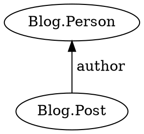
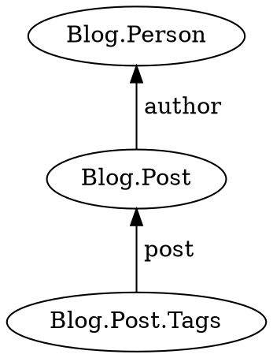
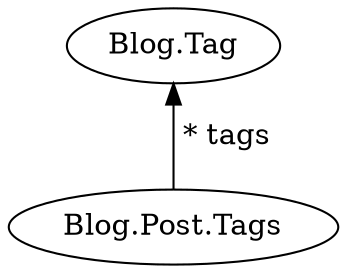
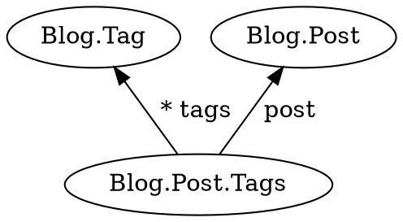

Execute a query for facts matching a template.

```typescript
query<T, U>(
    start: T,
    preposition: Preposition<T, U>
): Promise<U[]>;
```

## Parameters

* **start** - A fact from which to begin the query
* **preposition** - A template function passed into [`j.for`](../for/)

## Returns

* A promise that resolves to an array of results

## Examples

Query for successors of a fact.



```typescript
function postsByAuthor(a) {
    return j.match({
        type: 'Blog.Post',
        author: a
    });
}

const posts = await j.query(person, j.for(postsByAuthor));
```

[Try it](/examples/query/successors)

Query for successors of successors.



```typescript
function tagsForPost(p) {
    return j.match({
        type: 'Blog.Post.Tags',
        post: p
    });
}

const tags = await j.query(person, j
    .for(postsByAuthor)
    .then(tagsForPost));
// Returns array of Blog.Post.Tags facts. For example:
// [{
//     type: 'Blog.Post.Tags',
//     post: {
//         type: 'Blog.Post',
//         created: '2018-12-23T22:46:02.487Z',
//         author: { ... }
//     },
//     tags: [{
//         type: 'Blog.Tag',
//         name: 'React'
//     }, {
//         type: 'Blog.Tag',
//         name: 'CSS'
//     }, {
//         type: 'Blog.Tag',
//         name: 'Micro-Frontends'
//     }]
// }]
```

[Try it](/examples/query/successors-of-successors)

The above can be combined into a single template function if desired.

```typescript
function tagsForPostsByAuthor(a) {
    return j.match({
        type: 'Blog.Post.Tags',
        post: {
            type: 'Blog.Post',
            author: a
        }
    });
}

const tags = await j.query(person, j.for(tagsForPostsByAuthor));
```

[Try it](/examples/query/combined-successors-of-successors)

When a fact has many predecessors, use an array within the template function.



```typescript
function postTagsByTag(t) {
    return j.match({
        type: 'Blog.Post.Tags',
        tags: [t]
    });
}

const postTags = await j.query(tag, j.for(postTagsByTag));
```

[Try it](/examples/query/many-predecessors)

Query for predecessor of successors.



```typescript
function postForPostTag(pt) {
    pt.has('post');

    return j.match(pt.post);
}

const posts = await j.query(tag, j
    .for(postTagsByTag)
    .then(postForPostTag));
```

[Try it](/examples/query/predecessors-of-successors)