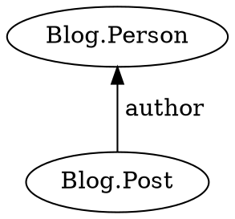
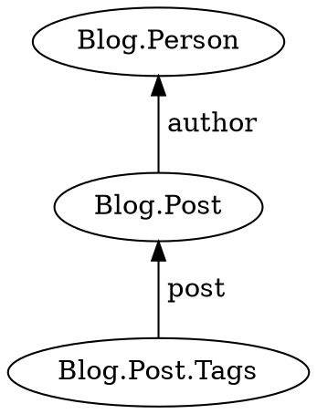
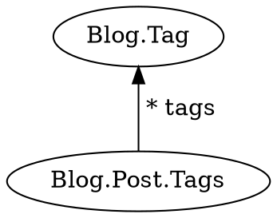
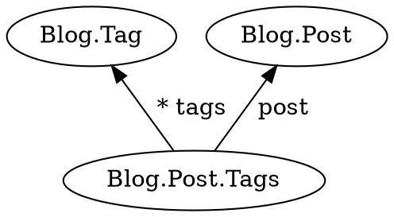

Execute a query for facts matching a template.

```typescript
query<T, U>(
    start: T,
    preposition: Preposition<T, U>
): Promise<U[]>;
```

## Parameters

* **start** - A fact from which to begin the query
* **preposition** - A template function passed into [`j.for`](../for/)

## Returns

* A promise that resolves to an array of results

## Examples

Query for successors of a fact.
What is a successor?
It's the opposite of a predecessor.
If a person is the predecessor of a post, then a post is a successor of a person.



You don't want just any successor.
You want those of a specific type with a specific relationship.
Express this by writing a template function.

```typescript
function postsByAuthor(a) {
    return j.match({
        type: 'Blog.Post',
        author: a
    });
}

const posts = await j.query(person, j.for(postsByAuthor));
```

[Try it](/examples/query/successors)

Query for successors of successors.
You can find all the grandchildren of a fact by joining two queries together using `then`.



```typescript
function tagsForPost(p) {
    return j.match({
        type: 'Blog.Post.Tags',
        post: p
    });
}

const tags = await j.query(person, j
    .for(postsByAuthor)
    .then(tagsForPost));
```

[Try it](/examples/query/successors-of-successors)

The above can be combined into a single template function if desired.

```typescript
function tagsForPostsByAuthor(a) {
    return j.match({
        type: 'Blog.Post.Tags',
        post: {
            type: 'Blog.Post',
            author: a
        }
    });
}

const tags = await j.query(person, j.for(tagsForPostsByAuthor));
```

[Try it](/examples/query/combined-successors-of-successors)

When a fact has many predecessors, use an array within the template function.
Even though the template lists only one predecessor, the query will match if that predecessor is anywhere in the array.



```typescript
function postTagsByTag(t) {
    return j.match({
        type: 'Blog.Post.Tags',
        tags: [t]
    });
}

const postTags = await j.query(tag, j.for(postTagsByTag));
```

[Try it](/examples/query/many-predecessors)

Query for predecessor of successors.
In other words, go down to children, and then back up to a different parent.
Kind of like a step-mother query.



You need to explicitly state that the successor `has` a field.
Once you do, you can use that field within the match.

```typescript
function postForPostTag(pt) {
    pt.has('post');

    return j.match(pt.post);
}

const posts = await j.query(tag, j
    .for(postTagsByTag)
    .then(postForPostTag));
```

[Try it](/examples/query/predecessors-of-successors)