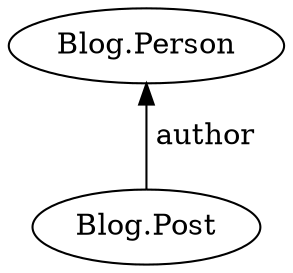
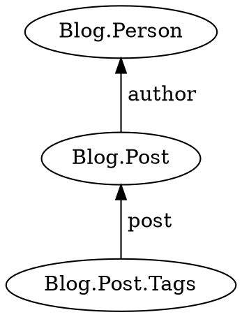

Prepare a template function to be used in [`query`](../query/) or [`watch`](../watch/).

```typescript
static for<T, U>(
    specification: (target: T) => Specification<U>
): Preposition<T, U>;
```

## Parameters

* **specification** - A template function, which returns [`j.match`](../match/)

## Returns

* A [preposition](../../preposition/) that can be passed to `query` or `watch`, or used to construct a preposition chain

## Examples

Prepare a template function for `query`.



```typescript
function postsByAuthor(a) {
    return j.match({
        type: 'Blog.Post',
        author: a
    });
}

const posts = await j.query(person, j.for(postsByAuthor));
```

Build a preposition chain.



```typescript
function tagsForPost(p) {
    return j.match({
        type: 'Blog.Post.Tags',
        post: p
    });
}

const tags = await j.query(person, j
    .for(postsByAuthor)
    .then(tagsForPost));
```