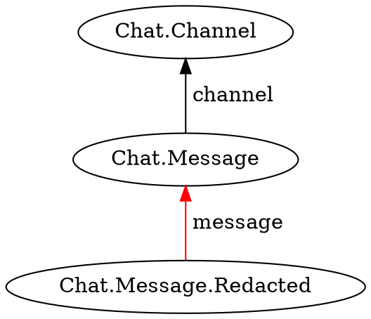

Used within a template function to specify the shape of the target facts.

```typescript
static match<T>(
    template: T
): Specification<T>;
```

## Parameters

* **template** - A JSON object with the desired `type` and predecessors

## Returns

* A specification that can be used by [`query`](../query/) or [`watch`](../watch/)

## Examples

This function can be used either as a static or an instance function.
If you already have an instance `j` of the Jinaga object, you can call `j.match`.

However, if you are defining a library of template functions, you usually do not have the instance `j` in scope.
In this situation, you can alias the `Jinaga` class to call `j.match` as a static function.

```typescript
import { Jinaga as j } from 'jinaga';

function postsByAuthor(a) {
    return j.match({
        type: 'Blog.Post',
        author: a
    });
}
```

Call `suchThat` to attach a condition to the template.



```typescript
function messagesInChannel(c) {
    return j.match({
        type: 'Chat.Message',
        channel: c
    }).suchThat(j.not(messageIsRedacted));
}

function messageIsRedacted(m) {
    return j.exists({
        type: 'Chat.Message.Redacted',
        message: m
    });
}
```