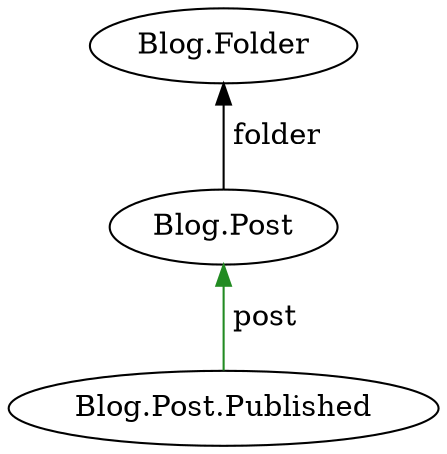
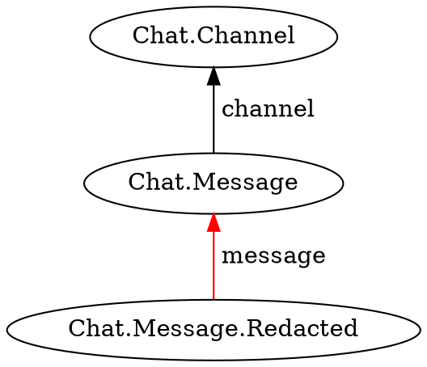

Used in a template function to create a condition that is true if a matching fact exists.

```typescript
static exists<T>(
    template: T
): Condition<T>;
```

## Parameters

* **template** - A JSON object with the desired `type` and predecessors

## Returns

* A condition that can be used in `suchThat` or [`not`](../not/)

## Examples

Return only facts that have a specified successor.



```typescript
function publishedPostsInFolder(f) {
    return j.match({
        type: 'Blog.Post',
        folder: f
    }).suchThat(postIsPublished);
}

function postIsPublished(p) {
    return j.exists({
        type: 'Blog.Post.Published',
        post: p
    });
}
```

Return only facts that do not have a specified successor.



```typescript
function messagesInChannel(c) {
    return j.match({
        type: 'Chat.Message',
        channel: c
    }).suchThat(j.not(messageIsRedacted));
}

function messageIsRedacted(m) {
    return j.exists({
        type: 'Chat.Message.Redacted',
        message: m
    });
}
```

The above can be expressed in terms of [`notExists`](./not-exists).
The result is the same.

```typescript
function messagesInChannel(c) {
    return j.match({
        type: 'Chat.Message',
        channel: c
    }).suchThat(messageIsNotRedacted);
}

function messageIsNotRedacted(m) {
    return j.notExists({
        type: 'Chat.Message.Redacted',
        message: m
    });
}
```