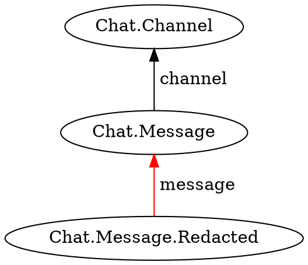

Inverts a condition defined using [`exists`](../exists/) or [`notExists`](./not-exists).

```typescript
static not<T, U>(
    condition: (target: T) => Condition<U>
): (target: T) => Condition<U>;
```

## Parameters

* **condition** - A template function using exists or notExists to invert

## Returns

* The opposite condition

## Examples

Return only facts that do not have a specified successor.



```typescript
function messagesInChannel(c) {
    return j.match({
        type: 'Chat.Message',
        channel: c
    }).suchThat(j.not(messageIsRedacted));
}

function messageIsRedacted(m) {
    return j.exists({
        type: 'Chat.Message.Redacted',
        message: m
    });
}
```