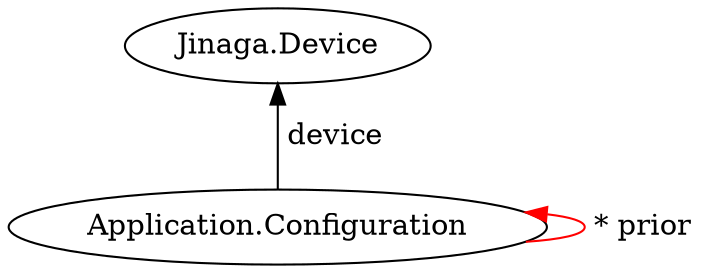

Access the identity of the local machine.
This method is only valid for the server and clients with local storage.
The local machine's identity is not shared with remote machines.

```typescript
local<D>(
): Promise<D>;
```

## Parameters

None

## Returns

* A promise that resolves to the local machine's identity

## Throws

* **Local device has no persistence** if called within the browser with no local storage

## Examples

Store device configuration on the local machine.



```typescript
function configurationOnDevice(d) {
    return j.match({
        type: 'Application.Configuration',
        device: d
    }).suchThat(configurationIsCurrent);
}

function configurationIsCurrent(c) {
    return j.notExists({
        type: 'Application.Configuration',
        prior: [c]
    });
}

const device = await j.local();
const configurations = await j.query(device, j.for(configurationOnDevice));
await j.fact({
    type: 'Application.Configuration',
    device: device,
    setting1: 'Setting 1 value',
    setting2: 'Setting 2 value',
    prior: configurations
});
```

Read device configuration on the local machine.

```typescript
const device = await j.local();
const configurations = await j.query(device, j.for(configurationOnDevice));
if (configurations.length === 1) {
    const { setting1, setting2 } = configurations[0];
}
```