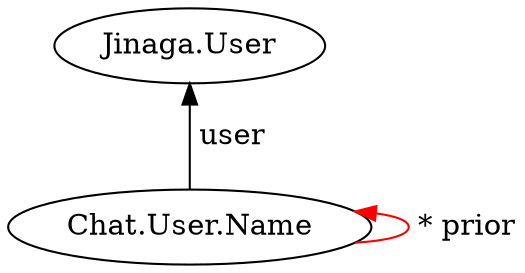

Log the user in and return a fact that represents their identity.
This method is only valid in the browser.

```typescript
login<U>(
): Promise<{
    userFact: U;
    profile: Profile
}>;
```

## Parameters

None

## Returns

* A promise that resolves to a fact that represents the user's identity, and the user's profile as reported by the configured [Passport](http://www.passportjs.org/) strategy

## Examples

Display messages sent to the logged in user.


```typescript
function messagesToUser(u) {
    return j.match({
        type: 'Chat.Message',
        to: u
    });
}

function displayMessage(m) {
    // Show the message on the UI.
}

const { userFact } = await j.login();

j.watch(userFact, j.for(messagesToUser), displayMessage);
```

Create a fact representing the user's display name so that other people can read it.



```typescript
function namesForUser(u) {
    return j.match({
        type: 'Chat.User.Name',
        user: u
    }).suchThat(nameIsCurrent);
}

function nameIsCurrent(n) {
    return j.notExists({
        type: 'Chat.User.Name',
        prior: [n]
    });
}

const { userFact, profile } = await j.login();
const names = await j.query(userFact, j.for(namesForUser));
if (names.length != 1 || names[0].value !== profile.displayName) {
    await j.fact({
        type: 'Chat.User.Name',
        user: userFact,
        prior: names,
        value: profile.displayName
    });
}
```