Generate a diagram of all facts in memory.
The diagram is written in the DOT graph language.
Use [graphviz.org](https://graphviz.org) to visualize the diagram.

```typescript
graphviz(
): string;
```

## Returns

* A DOT diagram of facts in memory

## Examples

The following diagram illustrates a blog post with a title and tags.

```dot
digraph {
rankdir=BT
node [shape=none]
"S0pJzmF4UVz5rmhBEqVtOmVio0b6v51HvpJYTthlUAIwAWyEol9HqOed40Z6vF64Vnm6m6N/39azBpyqUECstg==" [label=<<TABLE BORDER="0" CELLBORDER="1" CELLSPACING="0"><TR><TD COLSPAN="2">Jinaga.User</TD></TR><TR><TD>publicKey</TD><TD>iylUz7vMsEYkuyWO</TD></TR></TABLE>>]
"jVY3XCN4e8dY5SYDVaGM5AvGIvp4mubYzhW6mp5W4CylnmPVBNg7WEHvv04xTM5n1Jigp+auxwxnD9+RK22Yig==" [label=<<TABLE BORDER="0" CELLBORDER="1" CELLSPACING="0"><TR><TD COLSPAN="2">Blog.User.Name</TD></TR><TR><TD>value</TD><TD>&quot;Michael Perry&quot;</TD></TR></TABLE>>]
"jVY3XCN4e8dY5SYDVaGM5AvGIvp4mubYzhW6mp5W4CylnmPVBNg7WEHvv04xTM5n1Jigp+auxwxnD9+RK22Yig==" -> "S0pJzmF4UVz5rmhBEqVtOmVio0b6v51HvpJYTthlUAIwAWyEol9HqOed40Z6vF64Vnm6m6N/39azBpyqUECstg==" [label="user"]
"jWuweU63182LYUlcprT7oi6MnX3gndbAES6avCw390GwBrmzChjrtnQEkqJWvzr0KdHCqcdIOLmfkYsb2ksVxQ==" [label=<<TABLE BORDER="0" CELLBORDER="1" CELLSPACING="0"><TR><TD COLSPAN="2">Blog.Post</TD></TR><TR><TD>created</TD><TD>&quot;2018-12-24T22:16:19.095Z&quot;</TD></TR></TABLE>>]
"jWuweU63182LYUlcprT7oi6MnX3gndbAES6avCw390GwBrmzChjrtnQEkqJWvzr0KdHCqcdIOLmfkYsb2ksVxQ==" -> "S0pJzmF4UVz5rmhBEqVtOmVio0b6v51HvpJYTthlUAIwAWyEol9HqOed40Z6vF64Vnm6m6N/39azBpyqUECstg==" [label="author"]
"RuXdVXlNqKD1oDik0IYr7F1nz/6scu76f9iNBc/vZlISMq8p3sfakWDw+/36ie1MoOq13VZt5C5WLXz4r4amTw==" [label=<<TABLE BORDER="0" CELLBORDER="1" CELLSPACING="0"><TR><TD COLSPAN="2">Blog.Post.Title</TD></TR><TR><TD>value</TD><TD>&quot;Pattern-Driven User Interfaces&quot;</TD></TR></TABLE>>]
"RuXdVXlNqKD1oDik0IYr7F1nz/6scu76f9iNBc/vZlISMq8p3sfakWDw+/36ie1MoOq13VZt5C5WLXz4r4amTw==" -> "jWuweU63182LYUlcprT7oi6MnX3gndbAES6avCw390GwBrmzChjrtnQEkqJWvzr0KdHCqcdIOLmfkYsb2ksVxQ==" [label="post"]
"NvFjq0TKYHUBKg5Y0olHb8bvdythyOkfXI4DZaE7U3zBIRNrKSGvWZBgj1axRvg/3j4DAaTeKuy8TShUeaPQng==" [label=<<TABLE BORDER="0" CELLBORDER="1" CELLSPACING="0"><TR><TD COLSPAN="2">Blog.Post.Title</TD></TR><TR><TD>value</TD><TD>&quot;Composite UX with Pattern Lab&quot;</TD></TR></TABLE>>]
"NvFjq0TKYHUBKg5Y0olHb8bvdythyOkfXI4DZaE7U3zBIRNrKSGvWZBgj1axRvg/3j4DAaTeKuy8TShUeaPQng==" -> "jWuweU63182LYUlcprT7oi6MnX3gndbAES6avCw390GwBrmzChjrtnQEkqJWvzr0KdHCqcdIOLmfkYsb2ksVxQ==" [label="post"]
"NvFjq0TKYHUBKg5Y0olHb8bvdythyOkfXI4DZaE7U3zBIRNrKSGvWZBgj1axRvg/3j4DAaTeKuy8TShUeaPQng==" -> "RuXdVXlNqKD1oDik0IYr7F1nz/6scu76f9iNBc/vZlISMq8p3sfakWDw+/36ie1MoOq13VZt5C5WLXz4r4amTw==" [label="prior"]
"27yzEdsb9LVxg+/m4Gd7I8p7JaNM4tuthkp4h2l3hR29y9toUlrP+5O+97VfCWs9J9J3vDPoeZNuoOlgQ2x8Xw==" [label=<<TABLE BORDER="0" CELLBORDER="1" CELLSPACING="0"><TR><TD COLSPAN="2">Blog.Tag</TD></TR><TR><TD>name</TD><TD>&quot;React&quot;</TD></TR></TABLE>>]
"LZS8Arqxh3o5nQDgnxzGj09f/2mJddtYIL9iFJhV0i94hesNNphZT+uilsX6Er6YDKiZEOUuJhbKsIcMvYSKyQ==" [label=<<TABLE BORDER="0" CELLBORDER="1" CELLSPACING="0"><TR><TD COLSPAN="2">Blog.Tag</TD></TR><TR><TD>name</TD><TD>&quot;CSS&quot;</TD></TR></TABLE>>]
"WOp0LU0uo0u4dh2FcUL4eyvU/qTlsvDaRATUs2v8g1Dz7BmU7lH19rotzDAott2KwIjRjELotMeKGxab8M5ypw==" [label=<<TABLE BORDER="0" CELLBORDER="1" CELLSPACING="0"><TR><TD COLSPAN="2">Blog.Tag</TD></TR><TR><TD>name</TD><TD>&quot;Micro-Frontends&quot;</TD></TR></TABLE>>]
"cLmjufJmp9vldapDKQBxwQ3WW+fuyW++KxsP9kGt4qbNobftWk3oZsUdgXoMkZNWdygHu6y2s/Z5MJJ+6zr2tA==" [label=<<TABLE BORDER="0" CELLBORDER="1" CELLSPACING="0"><TR><TD COLSPAN="2">Blog.Post.Tags</TD></TR></TABLE>>]
"cLmjufJmp9vldapDKQBxwQ3WW+fuyW++KxsP9kGt4qbNobftWk3oZsUdgXoMkZNWdygHu6y2s/Z5MJJ+6zr2tA==" -> "jWuweU63182LYUlcprT7oi6MnX3gndbAES6avCw390GwBrmzChjrtnQEkqJWvzr0KdHCqcdIOLmfkYsb2ksVxQ==" [label="post"]
"cLmjufJmp9vldapDKQBxwQ3WW+fuyW++KxsP9kGt4qbNobftWk3oZsUdgXoMkZNWdygHu6y2s/Z5MJJ+6zr2tA==" -> "27yzEdsb9LVxg+/m4Gd7I8p7JaNM4tuthkp4h2l3hR29y9toUlrP+5O+97VfCWs9J9J3vDPoeZNuoOlgQ2x8Xw==" [label="tags"]
"cLmjufJmp9vldapDKQBxwQ3WW+fuyW++KxsP9kGt4qbNobftWk3oZsUdgXoMkZNWdygHu6y2s/Z5MJJ+6zr2tA==" -> "LZS8Arqxh3o5nQDgnxzGj09f/2mJddtYIL9iFJhV0i94hesNNphZT+uilsX6Er6YDKiZEOUuJhbKsIcMvYSKyQ==" [label="tags"]
"cLmjufJmp9vldapDKQBxwQ3WW+fuyW++KxsP9kGt4qbNobftWk3oZsUdgXoMkZNWdygHu6y2s/Z5MJJ+6zr2tA==" -> "WOp0LU0uo0u4dh2FcUL4eyvU/qTlsvDaRATUs2v8g1Dz7BmU7lH19rotzDAott2KwIjRjELotMeKGxab8M5ypw==" [label="tags"]
}
```

