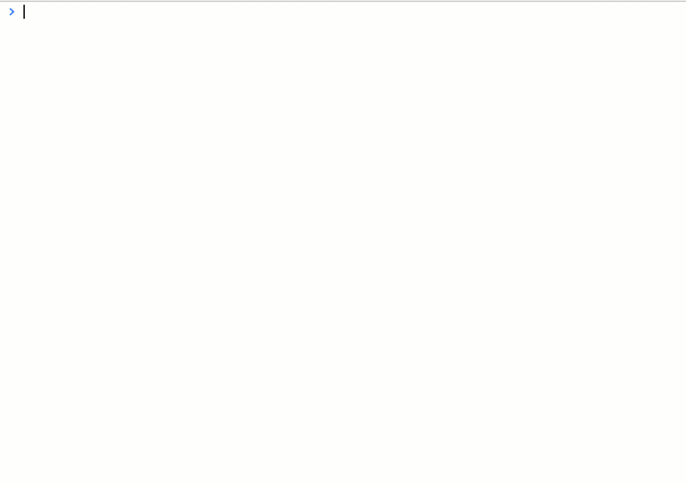

Open an inspector in the browser's console window to navigate through facts in memory.

```typescript
inspect(
): {};
```

## Returns

* An inspector listing all facts

## Examples

Drill down to see all facts of a given type.
List all predecessors and successors of a fact.

