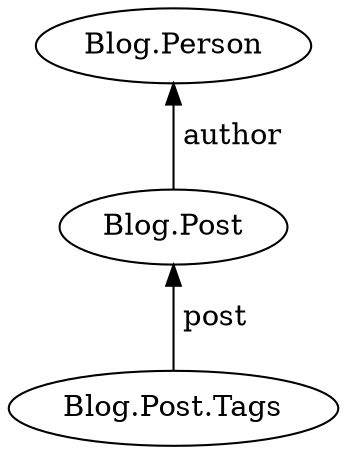

A chain of templates used in [`j.query`](../jinaga/query/) or [`j.watch`](../jinaga/watch/).

Begin the chain by calling [`j.for`](../jinaga/for/).
Extend it by calling [`then`](./then/).

## Examples

Build a preposition chain.



```typescript
function postsByAuthor(a) {
    return j.match({
        type: 'Blog.Post',
        author: a
    });
}

function tagsForPost(p) {
    return j.match({
        type: 'Blog.Post.Tags',
        post: p
    });
}

const tags = await j.query(person, j
    .for(postsByAuthor)
    .then(tagsForPost));
```