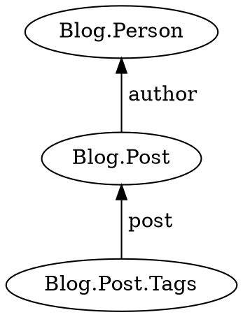
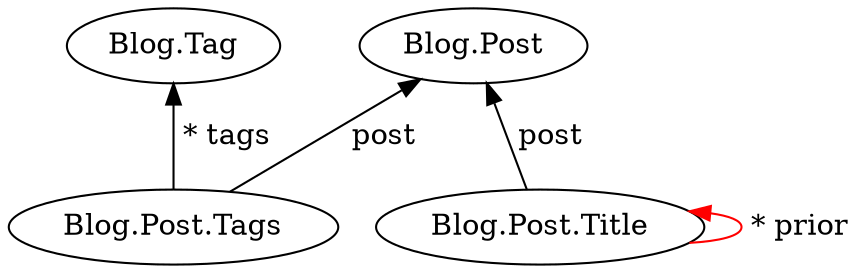

Extend a preposition chain.

```typescript
then<V>(
    specification: (target: U) => Specification<V>
    ): Preposition<U, V>;
```

## Parameters

* **specification** - A template function, which returns [`j.match`](../../jinaga/match/)

## Returns

* A preposition that can be passed to [`query`](../../jinaga/query/) or [`watch`](../../jinaga/watch/), or used to construct a preposition chain

## Examples

Build a preposition chain.



```typescript
function postsByAuthor(a) {
    return j.match({
        type: 'Blog.Post',
        author: a
    });
}

function tagsForPost(p) {
    return j.match({
        type: 'Blog.Post.Tags',
        post: p
    });
}

const tags = await j.query(person, j
    .for(postsByAuthor)
    .then(tagsForPost));
```

The above can be combined into a single template function.
But some queries cannot be.
For example, the following is a zig-zag query.
It starts by selecting successors.
Then it jumps up to a different predecessor, and then back down to different successors.



```typescript
function postTagsByTag(t) {
    return j.match({
        type: 'Blog.Post.Tags',
        tags: [t]
    });
}

function postTitlesForPostTag(pt) {
    pt.has('post');

    return j.match({
        type: 'Blog.Post.Title',
        post: pt.post
    }).suchThat(postTitleIsCurrent);
}

function postTitleIsCurrent(t) {
    return j.notExists({
        type: 'Blog.Post.Title',
        prior: [t]
    });
}

const titles = await j.query(tag, j
    .for(postTagsByTag)
    .then(postTitlesForPostTag));
```