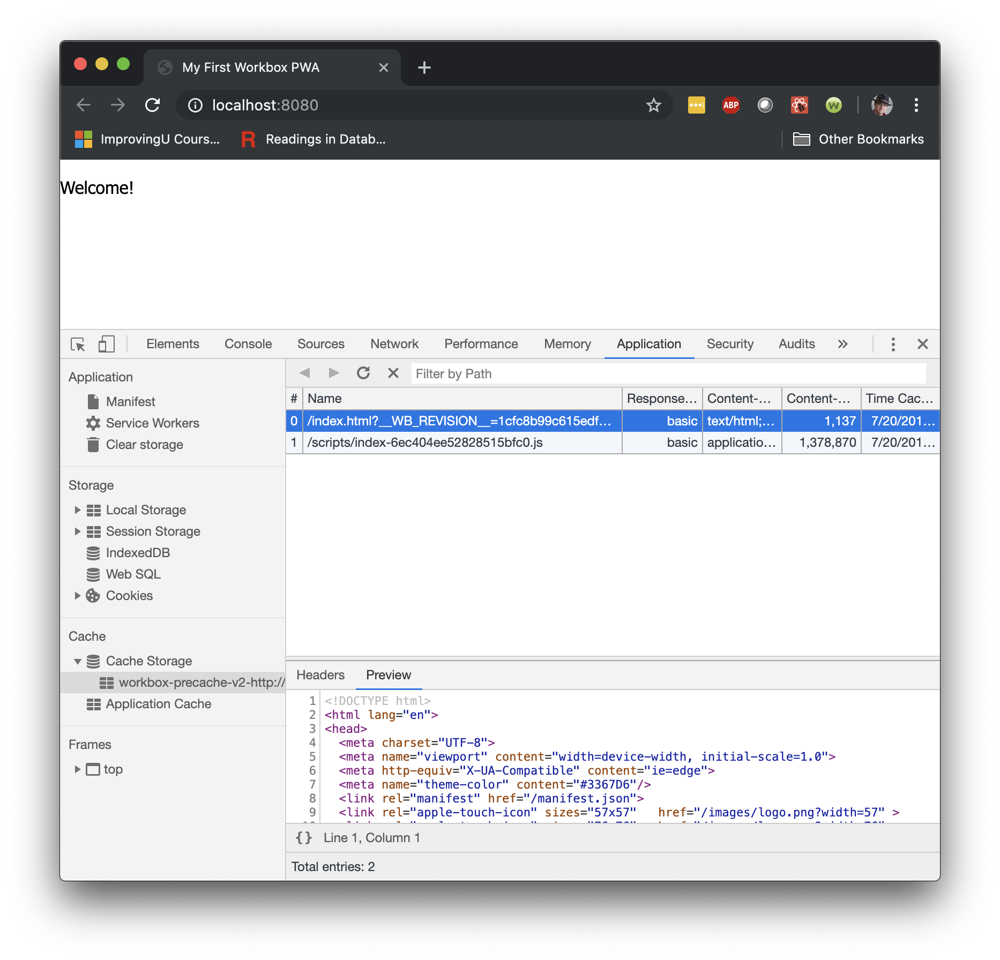
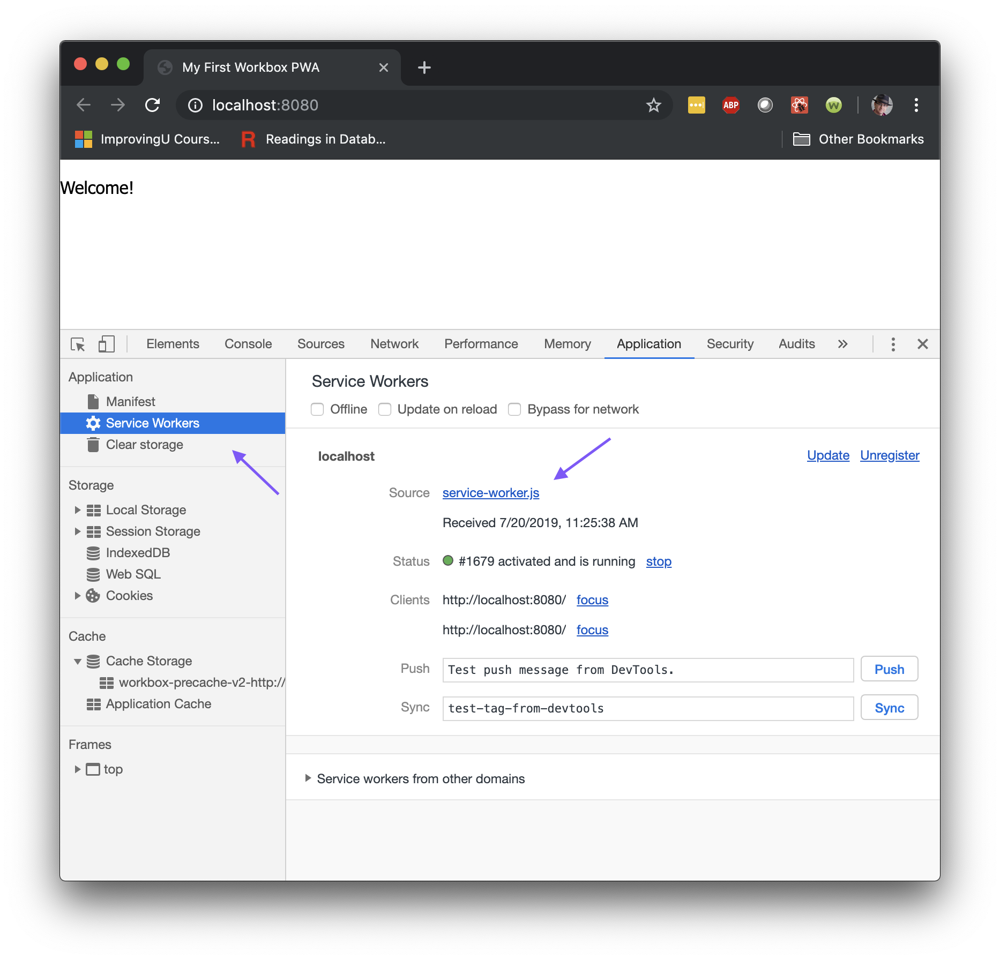
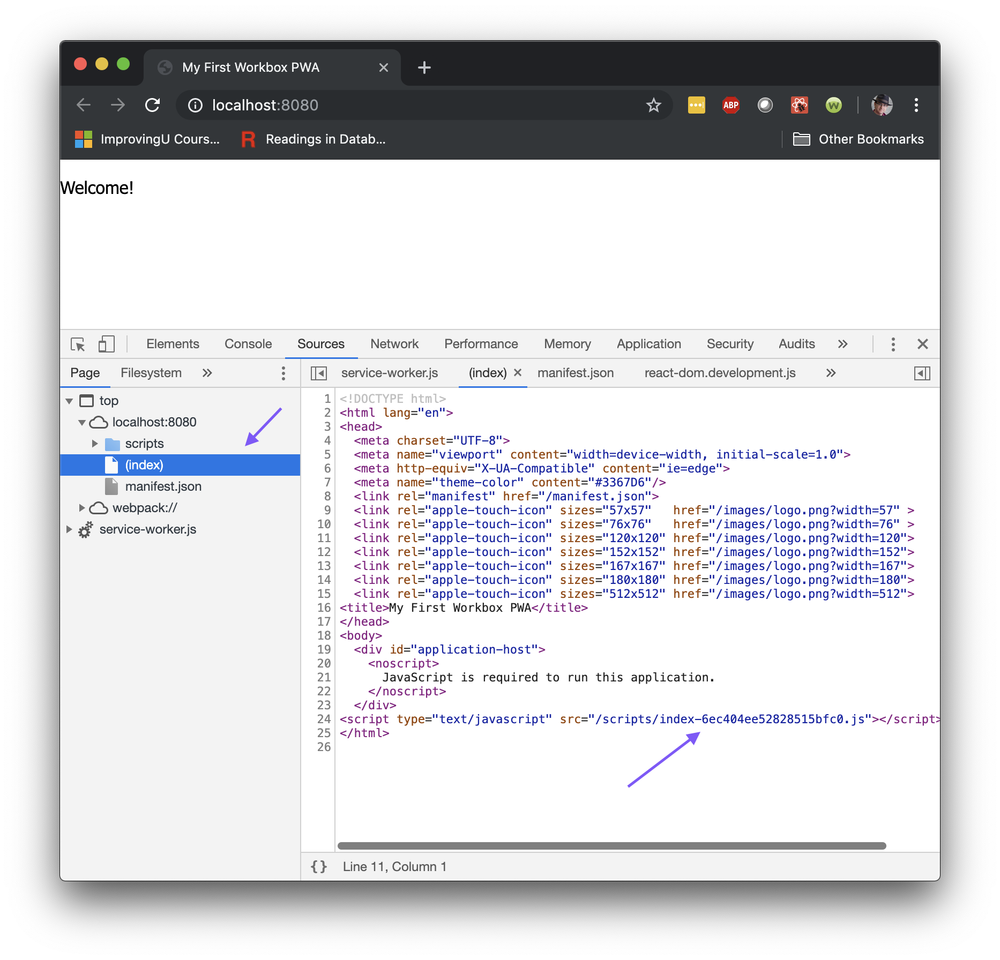
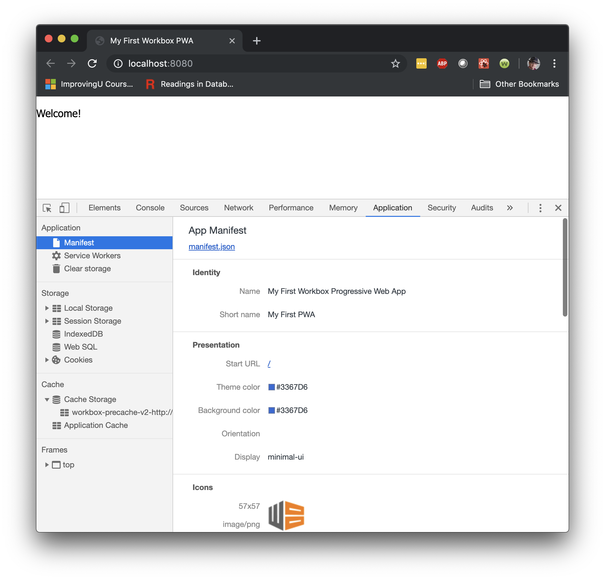
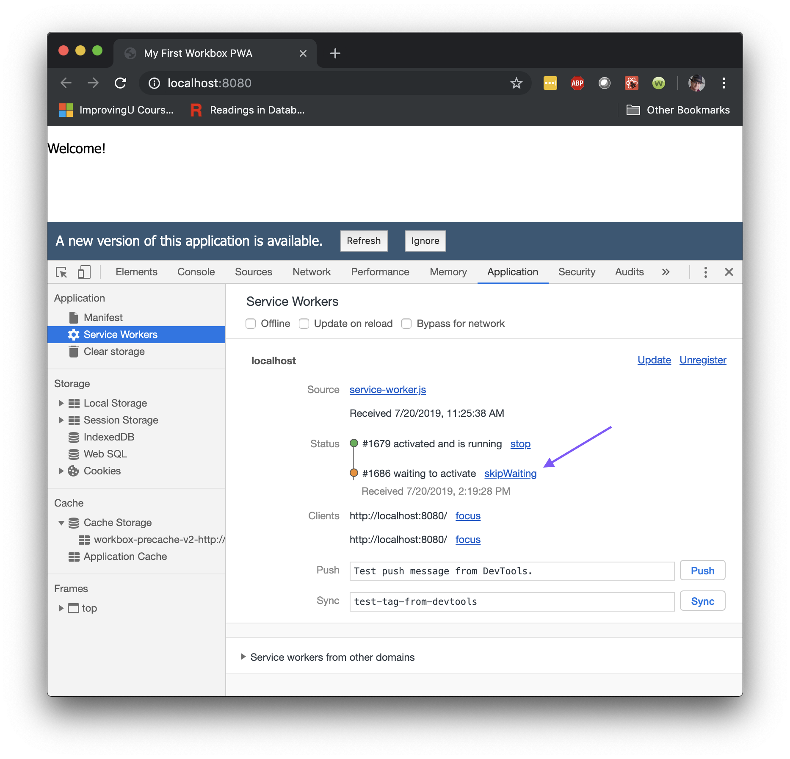
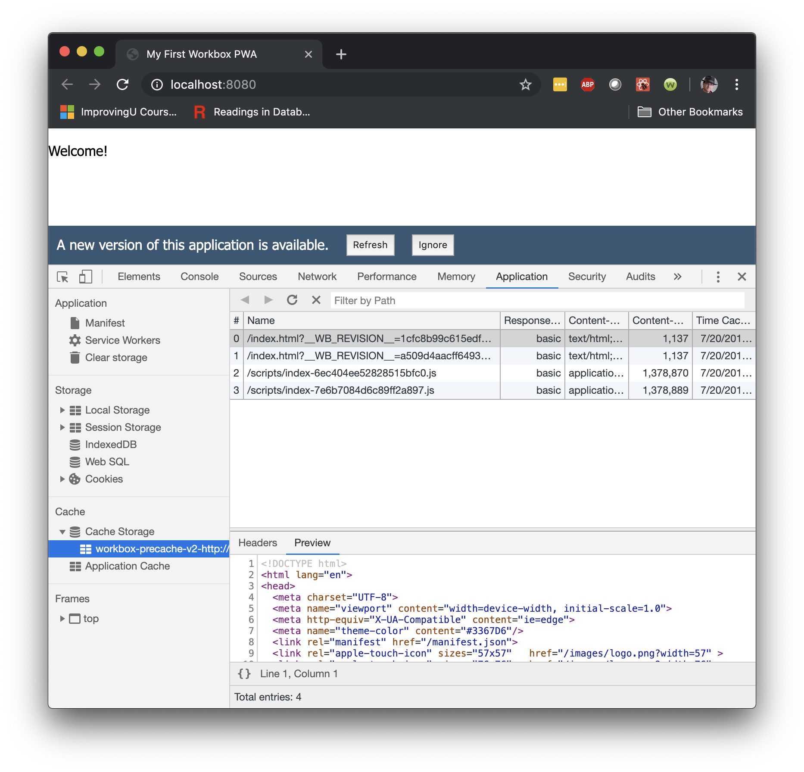
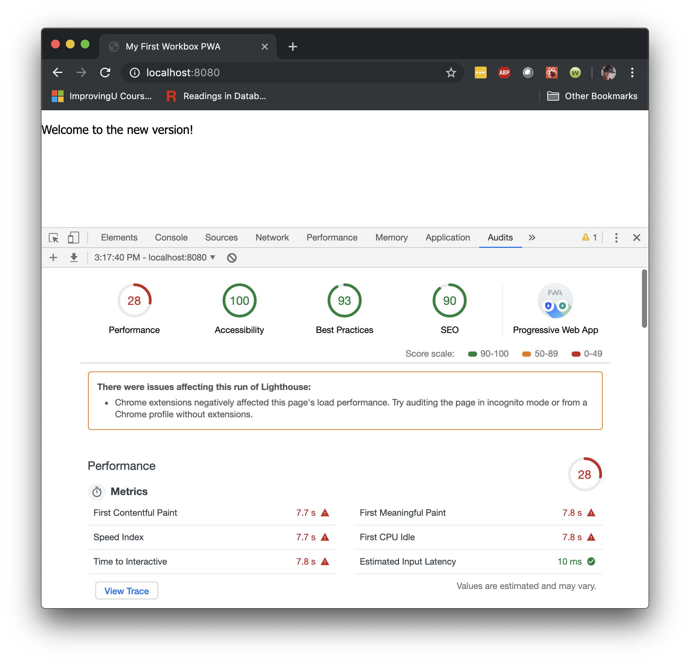
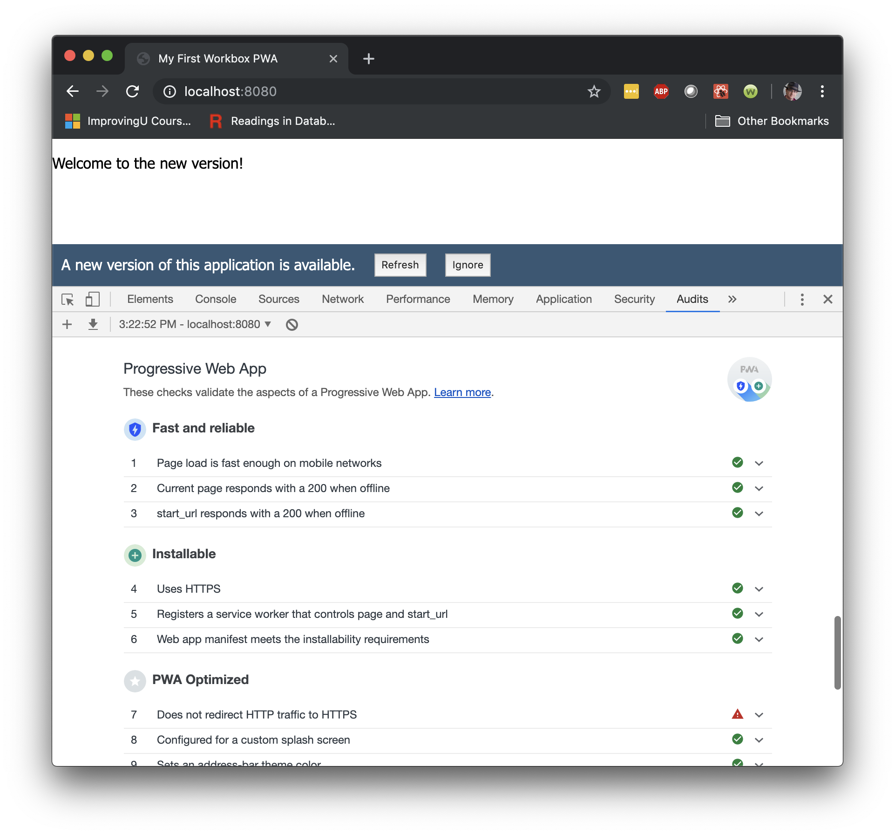

# Your First PWA

A workshop for building your first PWA.
Build a PWA using Gatsby.
Build another using Workbox.
And finally, build one using Jinaga.

## Gatsby

At first glance, Gatsby is a static site generator.
It turns markdown into web pages, and serves them from a static CDN.
But look behind the scenes, and Gatsby is so much more.
It's an ecosystem of plugins.
It's an application framework.
And it's a great way to get started writing your first PWA.

You can find the full instructions on [getting started with Gatsby](https://www.gatsbyjs.org/docs/).
What we will step through here is an abbreviated version designed to get your first PWA running.

### Node JS

To begin, you should be running [Node JS](https://nodejs.org/en/).
If you are on MacOS, use the Terminal window.
If you are on Windows, I recommend using [Windows Subsystem for Linux](https://docs.microsoft.com/en-us/windows/wsl/install-win10).

To make sure that Node is working, go to the Bash command line and run:

```bash
node -v
```

You should see something like `v10.15.3`.
Version 8 or later fine.

### Gatsby CLI

Go to your personal development directory (mine is `/Projects`, but yours might be `/Users/yourname/Projects`).
Initialize a new Gatsby project (I called mine `gatsbypwa`).
This will create a new folder.

```bash
cd /Projects
npx gatsby new gatsbypwa https://github.com/gatsbyjs/gatsby-starter-blog
cd gatsbypwa
```

### Start Editing

Open your favorite text editor and start modifying the application.
Start with the `content` folder, where you will find blog posts.
Spin up a development server, and see that changes apply as soon as you save them.
Cool, huh?

```bash
code .
npm start
```

The application will start at http://localhost:8000.

### Manifest and Offline Plugins

That's really cool and all, but what about Progressive Web Apps?
When Gatsby runs as a PWA, your visitors can take your content offline.
But you need to set that up.
Fortunately, there's a plugin (or two) for that.
[Full instructions](https://www.gatsbyjs.org/docs/add-offline-support-with-a-service-worker/) are in the Gatsby documentation, but here's the gist of it.

The two plugins that make a Gatsby site a PWA are `gatsby-plugin-manifest` and `gatsby-plugin-offline`.
Look for these declared in `gatsby-config.js`.
They set up a Web Manifest, and install a Service Worker, respectively.
But they only work in a production build.

```bash
npm run build
npx gatsby serve
```

This will start the server at http://localhost:9000/.
Navigate there with your browser to take a look at some of these artifacts.
Click on one of the blog articles so that it loads some content.
And then open the Chrome dev tools (⌥ + ⌘ + I on a Mac, or F12 on Windows) and open the *Application* tab.
Click on *Manifest* in the sidebar.


The app manifest tells the browser how to install the site as a stand-alone application.
It includes the title, color, icon, and most importantly the *Service Worker*.


The service worker is a bit of JavaScript code that runs in a separate sandbox from the front-end application.
The service worker is installed in the browser, and started up whenever the user navigates to its URL.
It then intercepts network requests.
This makes your application work even when it is offline.
Switch to the *Network* tab, check the "Offline" box, and refresh the page to see this in action.


The Gatsby service worker is programmed to first try to load the page from the server.
If that fails, then it serves up the cached content from *Cache Storage*.
Back on the *Application* tab, you can scan through the cached content.
Notice that this includes HTML, JavaScript, CSS, and any other file that the browser needs to download.


The Gatsby plugin precaches all of the assets needed to run the application, and all of the content that the user has visited.
It even navigates one page away from the visited content and precaches pages they haven't yet loaded.
Go offline and see if you can find some content that was not precached.
(Hint: it might be a *part* of a page that you haven't first visited.)

### Install as Application

Now that you've seen the manifest and service worker, let's see what they do for you.
Click the ellipses in the upper-right corner of the Chrome window.
Then click "Install Gatsby Starter Blog".


This will install the application in Chrome Web Apps on MacOS, or on the Desktop in Windows.
Double-click to launch this application.
It appears to run outside of the browser.
In fact, it is still running in the browser, but it is configured to use minimal UI chrome.


Stop the application server.
Now the application can't connect to load its content.
But that's OK.
It's running the service worker and loading content from the cache.
You can stop the application, restart it, and navigate through content.

## Workbox

Gatsby does a great job of caching content in a Progressive Web App.
But if you are writing your own app from scratch and not using Gatsby, you might need a little help.
[Google Workbox](https://developers.google.com/web/tools/workbox) is a toolkit for creating PWAs that gives you full control of the service worker.
You can find [a full walkthrough](https://developers.google.com/web/tools/workbox/guides/generate-service-worker/webpack) in the Workbox documentation, but we'll go through a targeted version here.

### Clone and Build

There is no fancy command line tool to get started.
Instead, we'll just clone a repository.
Go back to your project home folder and clone the repo.
Then change directories into the repo and clean up the Git association so you can start fresh.

```bash
git clone https://github.com/michaellperry/starter-javascript-workbox-react.git workboxpwa
cd workboxpwa
rm -rf .git
```

Then you can build and run the solution.

```bash
npm install
npm run build
npm run dev
```

The application starts at http://localhost:8080.

### Precache

The application is very welcoming.
Other than that, though, its behavior is mostly hidden.
We can explore it in the Chrome dev tools.
Open them up again (⌥ + ⌘ + I on a Mac, or F12 on Windows) and go to the *Application* tab.

Under the *Cache* heading, expand *Cache Storage* and take a look at the two files in cache.
One is `index.html`, and the other is a JavaScript bundle.



This is what Workbox does for us.
It pre-caches the assets used by our front-end application.
It then generates a service worker that serves them from cache when the browser requests them.

### Service Worker

The generated service worker is in service-worker.js.
You can inspect this file by first clicking on the *Service Worker* item in the sidebar, then clicking on the service.worker.js link.



There are a few important parts of this file.
The first two parts use the `importScripts` function built into the browser.
This function plays the same role as the `<script>` tag in HTML, loading a JavaScript file into the sandbox so it can run.
The first line imports the Workbox runtime from a CDN.
You could serve it from your site, but this takes advantage of Google's caches.

```javascript
importScripts("https://storage.googleapis.com/workbox-cdn/releases/4.3.1/workbox-sw.js");
```

The second line imports a manifest.

```javascript
importScripts(
  "/scripts/precache-manifest.8c5c2c7cb2a8b7d6f6bef8d24aa4ecfc.js"
);
```

You can find that manifest file in the `dist` folder.
The contents look like this:

```javascript
self.__precacheManifest = (self.__precacheManifest || []).concat([
  {
    "revision": "1cfc8b99c615edfd463556ed301e6349",
    "url": "/index.html"
  },
  {
    "url": "/scripts/index-6ec404ee52828515bfc0.js"
  }
]);
```

This adds a couple of entries to the precache manifest.
The `index.html` file has a revision hash so that Workbox can put a cache-busting query string parameter on it.
The JavaScript file, however, has the hash built into filename, so it doesn't need a revision hash.

Now back to the service worker.
The next section adds an event listener that we will find useful soon.
We'll get back to that.

```javascript
self.addEventListener('message', (event) => {
  if (event.data && event.data.type === 'SKIP_WAITING') {
    self.skipWaiting();
  }
});
```

Then finally, we use the precache manifest to call a Workbox function.

```javascript
self.__precacheManifest = [].concat(self.__precacheManifest || []);
workbox.precaching.precacheAndRoute(self.__precacheManifest, {});
```

The `precacheAndRoute` function fetches all of the assets from the server and puts them into *Cache Storage*.
It then intercepts all calls from the browser for those URLs, and serves them from the cache.

Now let's see how these HTML and JavaScript files came to be.

### Webpack

We built the HTML and JavaScript -- and even CSS though you can't see it -- using Webpack.
Webpack packages and bundles your Web assets to make them load faster and take up less room in cache.
Go back to your editor and look at the `webpack.config.js` file.
This file describes to Webpack how to build the bundles.

The `client` function at the beginning produces a Webpack configuration that builds the client-side bundles.
It creates a bundle for every `html` and `jsx` pair that it finds.
We currently only have `index`.

The configuration is broken into three sections.
The *Input* section tells Webpack where to find the source `jsx` files, and what extensions to resolve.
The *Processing* section tells it how to handle files of each extension: `jsx` or `scss`.
It also sets up a the HTML, Workbox, and file copy plugins, which we will look at more closely.
Finally, the *Output* section tells Webpack how to compose the bundles and where to put them.

This project uses Webpack to bundle the server-side code as well, which is handy for taking full advantage of modern JavaScript modules.
That configuration appears after the call to `client` in `module.exports`.

### HTML Plugin

Now let's focus on the HTML plugin.
This takes the `html` file and the *chunk* that Webpack produced from the `jsx`.
A chunk is a bundle of JavaScript and CSS reachable from a given entry point.
We told Webpack to use the `jsx` file as the entry point, so any file that was `import`ed by that file ended up in the chunk.

The `html` file is just a simple template for our PWA.
It has a few interesting things in it, like a theme color, a link to the manifest, and some touch icons for iOS.
These are all required (or at least strongly encouraged) for a PWA.

```html
<meta name="theme-color" content="#3367D6"/>
<link rel="manifest" href="/manifest.json">
<link rel="apple-touch-icon" sizes="57x57"   href="/images/logo.png?width=57" >
```

Then we have a place to put the React application.
This snippet has a fallback for browsers that have JavaScript disabled.
This is also a requirement for a PWA.

```html
<div id="application-host">
  <noscript>
    JavaScript is required to run this application.
  </noscript>
</div>
```

But notice what this file does *not* have.
It doesn't have a `<script>` tag to bring in the application.
That is what `HtmlWebpackPlugin` does.
It just finds the bottom of the `<body>` tag, and inserts a `<script>` tag for the chunk that Webpack generates.

Webpack will include the hash in the name of the chunk so that JavaScript can be aggressively cached.
That hash will change every time we modify the code.
So if the browser gets a cached version of the file, it knows that the code has not changed.
You can see the generated HTML file in the browser.



### Workbox Plugin

While the HTML plugin generates an HTML file for the foreground sandbox, the Workbox plugin generates a Service Worker file for the background sandbox.
It serves precisely the same purpose.
The chunk files that need to be cached will include revision hashes on each build.
This plugin puts those file names into the manifest that we looked at before.

There are a couple of nuances that we should be aware of.
If you look back at `webpack.config.js`, you will see that we told the plugin to output the file to the `scripts` folder.
However, we cannot serve it from the `scripts` folder.
A service worker will only intercept requests in its own folder and lower.
So if we served it from `http://localhost:8080/scripts/service-worker.js`, then the service worker could not serve up the `index.html` file at the root.

For this reason, you will find a route in `routes.js` that serves this one file from the root folder.
All other script files are served from `scripts`.

```javascript
app.use('/scripts', express.static(path.join(__dirname, 'scripts')));

app.get('/service-worker.js', (req, res) => {
  res.sendFile(path.join(__dirname, './scripts/service-worker.js'));
});
```

The next nuance to be aware of is that Workbox is smart enough to know that the default file is probably called `index.html`.
It will intercept a request for `http://localhost:8080/` and serve it from the cache as if it was looking for `http://localhost:8080/index.html`.
While that's cool and all, that also means that it will request `index.html` by name while populating the cache.
So our application has to serve the file from either `/`, or `/index.html`.

You can see how we configured this in `routes.js`.

```javascript
app.get(/^\/(index.html)?$/, (req, res) => {
  res.sendFile(path.join(__dirname, './index.html'));
});
```

With these details in place, Workbox can cache and serve all of the assets required to run the application.
Now the browser just needs to know that it is dealing with a PWA, which it learns by loading a manifest.

### Manifest

In the Gatsby example, we used a plugin to generate the manifest.
Now, we are responsible for writing it ourselves.
Fortunately, it's pretty simple.
The full documentation of the [Web App Manifest](https://developer.mozilla.org/en-US/docs/Web/Manifest) file is on MDN.

Our simple manifest file is in `manifest.js`.
We serve it up from a simple route:

```javascript
import {manifest} from './manifest';

app.get('/manifest.json', (req, res) => {
  res
    .header('Content-Type', 'application/json')
    .send(JSON.stringify(manifest));
});
```

You can see how the browser interprets the manifest file in the *Application* tab.



Modify the manifest file and refresh the page to see your changes reflected here.
Once you have the manifest the way you like it, you can install the application as you did before.

### Loading a New Build

Service workers have some strange behavior that doesn't make much sense right at first.
However, once you think about it a bit longer, it starts to make sense.
It's the way that a service worker responds to the refresh button.

To see this strange behavior, make a change to the application in `app.jsx`.
You can simply change the Welcome message.
Save the change and watch as Webpack rebuilds the application.
If you don't have Webpack running, then execute `npm run dev` again to get it started.

Now switch back to the browser and refresh the page.
You might expect to see the new Welcome message.
But instead, you will still see the old message.
After a brief pause, you will see a bar show up at the bottom of the page.
Don't click this quite yet.

What just happened?

If you switch to the *Application* tab and look at *Service Workers*, you will see that you now have *two* service workers in your list.



Open the *Cache Storage* and you will see two HTML files and two JavaScript bundles.



The cache contains both the old version and the new version of the app.
And two versions of the service worker have been loaded.
Only one of them is activated, while the other is waiting.

The browser can only send network requests to one version of a service worker at a time.
It doesn't matter how many tabs are open, every tab is using the same version of the service worker.
That service worker is listening for requests from the browser and serving assets from the cache.
A specific version of the service worker is tied to specific cache entries, including the Welcome message.

Once the service worker stops running, the browser can activate the one that is waiting.
At that point, it will start listening for fetch requests.
You can't stop a service worker from running by refreshing the page -- the service worker is running in the background and is not controlled by the page lifecycle.
Besides, serving up the page is what the service worker is *for*.
The service worker will stop when the browser closes.

Close the browser, then start it back up again.
Now you will see your updated Welcome message.
There will be only one service worker loaded, and there will only be two files in the cache.

That's a pretty heavy-handed way to update the application.
Fortunately, we have another tool.
Make another change and refresh the page so we are back to having a waiting service worker.
Then, go back to the *Application* tab and the *Service Workers* screen.
Click on the `skipWaiting` link next to the second service worker.
The first service worker will be stopped and the second will be activated.
You will also see the page refresh, and the Welcome message will change.

The `skipWaiting` function is available for us to call ourselves.
It has to be called by the new service worker, which is running but not receiving any fetch requests.
And that is the reason for the event listener that we saw before:

```javascript
self.addEventListener('message', (event) => {
  if (event.data && event.data.type === 'SKIP_WAITING') {
    self.skipWaiting();
  }
});
```

If you send a `SKIP_WAITING` event to the new service worker, it will stop waiting for the old one to shut down.
You can send the event from the front end.

```javascript
if (reg.waiting) {
  reg.waiting.postMessage({ type: 'SKIP_WAITING' });
}
```

The `reg` above is the service worker registration object.
This code looks for a waiting service worker, and then posts the `SKIP_WAITING` message to it.
This gets called whenever the user clicks the *Refresh* button on the bar.
The code in `register-service-worker.js` sets this all up.
It even refreshes the page when a new service worker (called a *controller* in the event below) becomes active.

```javascript
let refreshing = false;
navigator.serviceWorker.addEventListener('controllerchange',
  () => {
    if (refreshing) return;
    refreshing = true;
    window.location.reload();
  }
);
```

For more information on how this pattern works, please see this [Redfin Engineering post by Dan Fabulich](https://redfin.engineering/how-to-fix-the-refresh-button-when-using-service-workers-a8e27af6df68).

### Audit

You finally have a PWA working the way you want it to.
But before you push it to production and tell everyone to download it, you might want to run a quick audit.
Open up the *Audits* tab in the browser, and scroll to the bottom of the form.
Click the *Run audits* button.

The screen will flash through your web page a few times.
When it's finished, you will have your results.



The performance is rubbish because we are running in development mode.
None of the JavaScript is minified.
But that's not what we're looking at right now.
Take a look at the PWA icon.
It has two little quarks in it.
We haven't earned the third quark, yet.
Click on it to scroll down for more details.



The first quark represents how *Fast and Reliable* the app is.
It's primarily measuring whether the application loads while it is offline.
To see this test fail, comment out the registration of the service worker from `register-service-worker.js`.

```javascript
// window.addEventListener('load', () => {
//   (async () => {
//     const registration = await navigator.serviceWorker.register('/service-worker.js');
//     console.log(`Registered service worker with scope ${registration.scope}.`);

//     listenForWaitingServiceWorker(registration, promptUserToRefresh(promptForRefresh));
//   })().catch(err => console.log(`Service worker registration failed: ${err}`));
// });
```

Then clear your audit results and run it again.
You will see that the dinosaur shows up during the test.
Without the service worker, the application can't respond while offline.
You will also see that we lost both quarks.

The second quark represents how *Installable* the app is.
We failed this test because we don't register a service worker.
Uncomment that code to get the service worker back, but now comment out the link to the manifest in `index.html`.

```html
<!-- <link rel="manifest" href="/manifest.json"> -->
```

Run the audits again.
The dinosaur is gone, but we still fail both of the tests.
The first one now fails because there is no `start_url`.
This is part of the manifest.

Uncomment the code so you can see your PWA passing again.
Well, at least mostly.
It fails the HTTPS redirection test, because we have that disabled in development mode.
If you deploy the project to [Netlify](https://netlify.com) or [Azure](https://azure.com), you will have a certificate and you will be using the production build.
It will redirect to HTTPS, and you will earn the third quark.
Incidentally, the performance will be much better as well, since it will be running minified JavaScript.

## Jinaga
