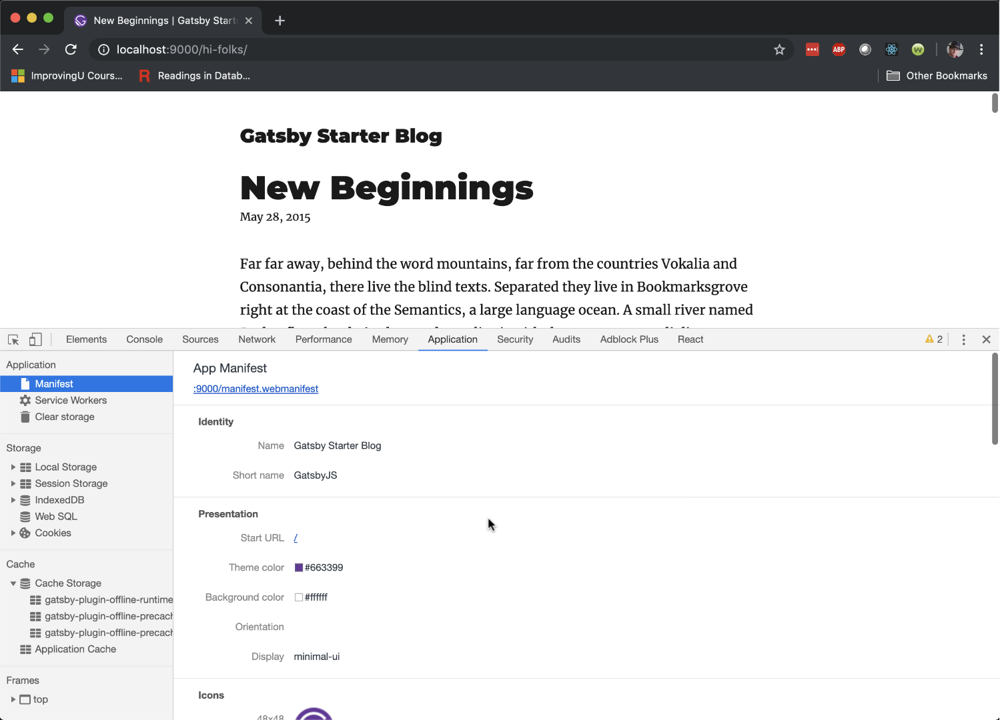
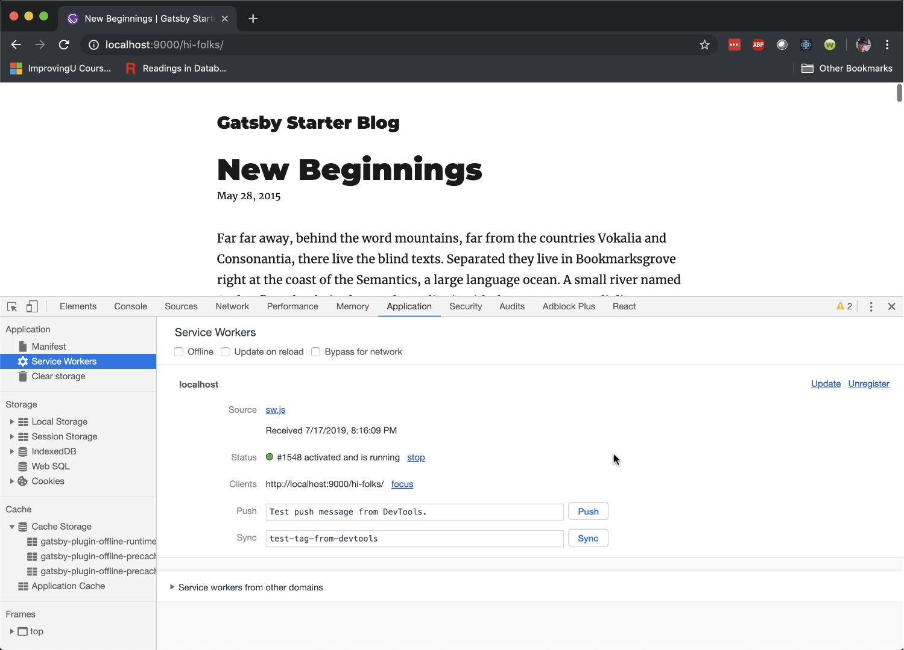
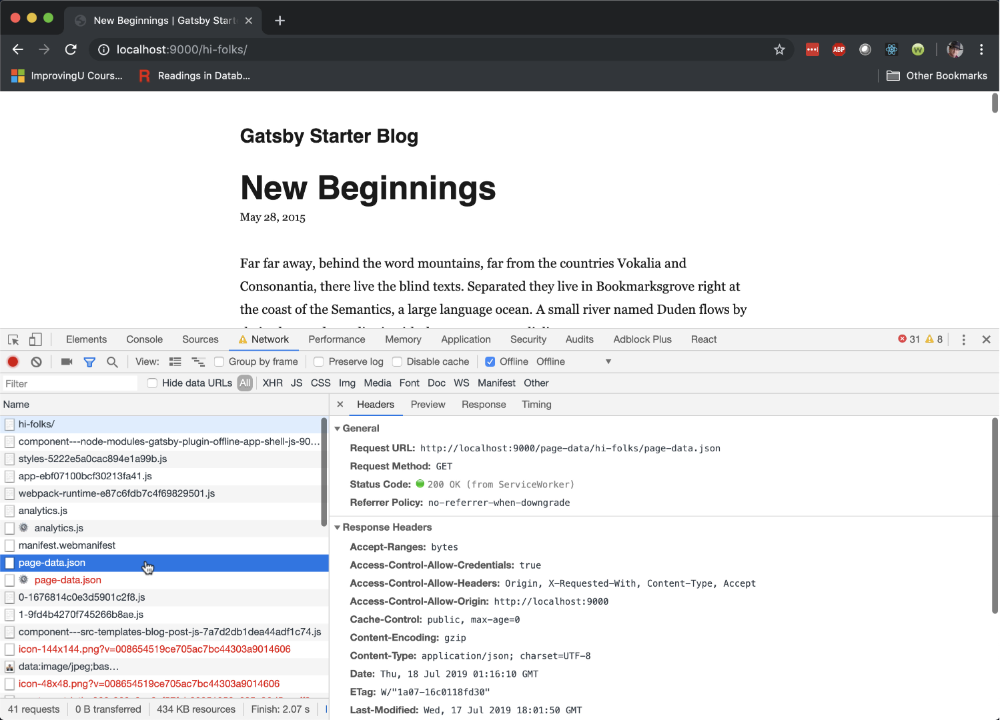
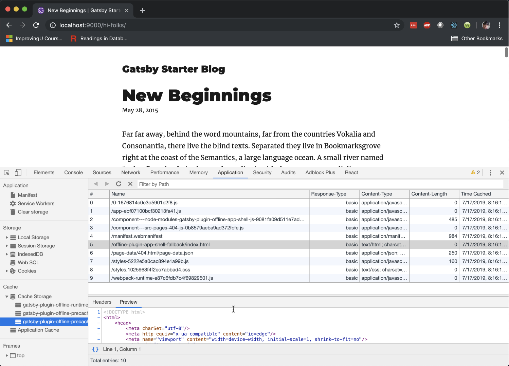
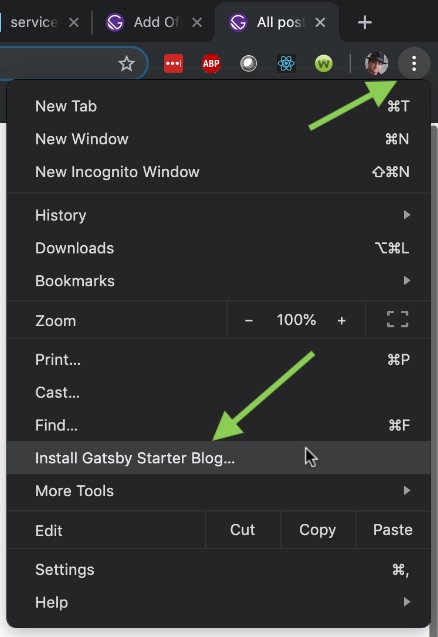
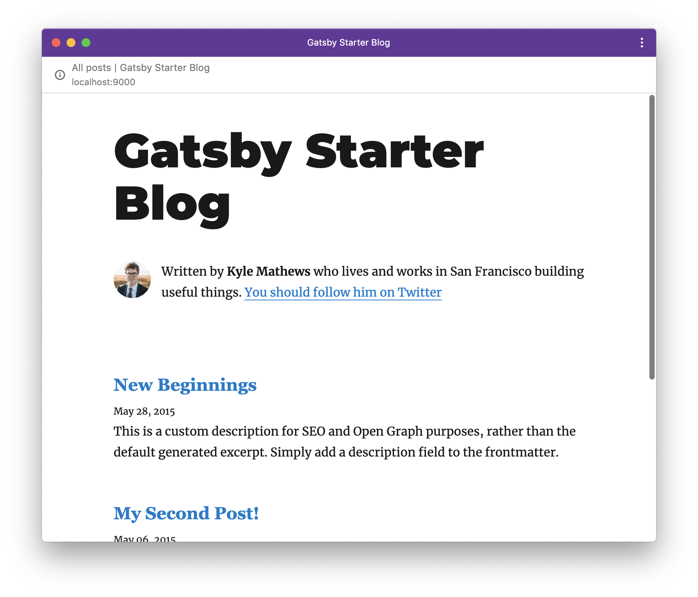

# Your First PWA

A workshop for building your first PWA.
Build a PWA using Gatsby.
Build another using Workbox.
And finally, build one using Jinaga.

## Gatsby

At first glance, Gatsby is a static site generator.
It turns markdown into web pages, and serves them from a static CDN.
But look behind the scenes, and Gatsby is so much more.
It's an ecosystem of plugins.
It's an application framework.
And it's a great way to get started writing your first PWA.

You can find the full instructions on [getting started with Gatsby](https://www.gatsbyjs.org/docs/).
What we will step through here is an abbreviated version designed to get your first PWA running.

### Node JS

To begin, you should be running [Node JS](https://nodejs.org/en/).
If you are on MacOS, use the Terminal window.
If you are on Windows, I recommend using [Windows Subsystem for Linux](https://docs.microsoft.com/en-us/windows/wsl/install-win10).

To make sure that Node is working, go to the Bash command line and run:

```bash
node -v
```

You should see something like `v10.15.3`.
Version 8 or later fine.

### Gatsby CLI

Go to your personal development directory (mine is `/Projects`, but yours might be `/Users/yourname/Projects`).
Initialize a new Gatsby project (I called mine `gatsbypwa`).
This will create a new folder.

```bash
cd /Projects
npx gatsby new gatsbypwa https://github.com/gatsbyjs/gatsby-starter-blog
cd gatsbypwa
```

### Start Editing

Open your favorite text editor and start modifying the application.
Start with the `content` folder, where you will find blog posts.
Spin up a development server, and see that changes apply as soon as you save them.
Cool, huh?

```bash
code .
npm start
```

The application will start at http://localhost:8000.

### Manifest and Offline Plugins

That's really cool and all, but what about Progressive Web Apps?
When Gatsby runs as a PWA, your visitors can take your content offline.
But you need to set that up.
Fortunately, there's a plugin (or two) for that.
[Full instructions](https://www.gatsbyjs.org/docs/add-offline-support-with-a-service-worker/) are in the Gatsby documentation, but here's the gist of it.

The two plugins that make a Gatsby site a PWA are `gatsby-plugin-manifest` and `gatsby-plugin-offline`.
Look for these declared in `gatsby-config.js`.
They set up a Web Manifest, and install a Service Worker, respectively.
But they only work in a production build.

```bash
npm run build
npx gatsby serve
```

This will start the server at http://localhost:9000/.
Navigate there with your browser to take a look at some of these artifacts.
Click on one of the blog articles so that it loads some content.
And then open the Chrome dev tools (⌥ + ⌘ + I on a Mac, or F12 on Windows) and open the *Application* tab.
Click on *Manifest* in the sidebar.



The app manifest tells the browser how to install the site as a stand-alone application.
It includes the title, color, icon, and most importantly the *Service Worker*.



The service worker is a bit of JavaScript code that runs in a separate sandbox from the front-end application.
The service worker is installed in the browser, and started up whenever the user navigates to its URL.
It then intercepts network requests.
This makes your application work even when it is offline.
Switch to the *Network* tab, check the "Offline" box, and refresh the page to see this in action.



The Gatsby service worker is programmed to first try to load the page from the server.
If that fails, then it serves up the cached content from *Cache Storage*.
Back on the *Application* tab, you can scan through the cached content.
Notice that this includes HTML, JavaScript, CSS, and any other file that the browser needs to download.



The Gatsby plugin precaches all of the assets needed to run the application, and all of the content that the user has visited.
It even navigates one page away from the visited content and precaches pages they haven't yet loaded.
Go offline and see if you can find some content that was not precached.
(Hint: it might be a *part* of a page that you haven't first visited.)

### Install as Application

Now that you've seen the manifest and service worker, let's see what they do for you.
Click the ellipses in the upper-right corner of the Chrome window.
Then click "Install Gatsby Starter Blog".



This will install the application in Chrome Web Apps on MacOS, or on the Desktop in Windows.
Double-click to launch this application.
It appears to run outside of the browser.
In fact, it is still running in the browser, but it is configured to use minimal UI chrome.



Stop the application server.
Now the application can't connect to load its content.
But that's OK.
It's running the service worker and loading content from the cache.
You can stop the application, restart it, and navigate through content.

## Workbox

Gatsby does a great job of caching content in a Progressive Web App.
But if you are writing your own app from scratch and not using Gatsby, you might need a little help.
[Google Workbox](https://developers.google.com/web/tools/workbox) is a toolkit for creating PWAs that gives you full control of the service worker.
You can find [the full walkthrough](https://developers.google.com/web/tools/workbox/guides/generate-service-worker/webpack) in the Workbox documentation, but we'll go through a targeted version here.

### NPM Initialization

Go back to your developer project folder.
Create a new Node application.

```bash
mkdir workboxpwa
cd workboxpwa
npm init -y
```

Then install the following packages:

```bash
npm install --save \
    body-parser \
    cookie-parser \
    express
```

And install the following development packages:

```bash
npm install --save-dev \
    webpack \
    webpack-cli \
    @webpack-cli/init
```

Then fire up your editor.

```bash
code .
```

### Express

Create a folder for your source code called `src`.
Create the application entry point.
This goes in `src/index.js`.

```javascript
const express = require('express');
const http = require('http');
const bodyParser = require('body-parser');

const app = express();
const server = http.createServer(app);

app.set("port", process.env.PORT || 8080);
app.use(bodyParser.json());

server.listen(app.get("port"), () => {
    console.log(`  App is running at http://localhost:${app.get("port")} in ${app.get("env")} mode`);
    console.log("  Press CTRL-C to stop\n");
});
```

Then add routes.
I prefer to create these in a separate file.
Add this to `src/routes.js`:

```javascript
const path = require('path');

function configureRoutes(app) {
    app.get("/", (req, res, next) => {
        res.sendFile(path.join(__dirname, "../views/index.html"));
    });
}

module.exports = { configureRoutes };
```

Include it in `index.js`:

```javascript
// Put this at the top.
const { configureRoutes } = require('./routes');

// Put this just before listen.
configureRoutes(app);
```

Now create a folder for your HTML called `views`.
Create a landing page at `views/index.html`.

```html
<html>
    <head>

    </head>

    <body>
        <p>Welcome!</p>
    </body>

</html>
```

Now you can start the app and open it in the browser.

```bash
node src/index
```

The app is running at http://localhost:8080/.

### Webpack

We're serving up some raw HTML, but to make this a real application, we need some client-side JavaScript.


## Jinaga
